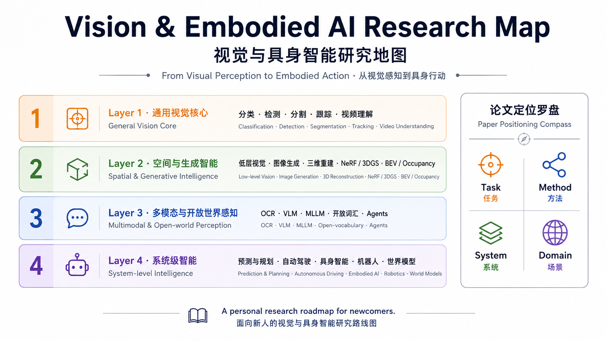

<div align="center">

# Vision & Embodied AI Research Map

# 视觉与具身智能研究地图



**From Visual Perception to Embodied Action**
**从视觉感知到具身行动**

A personal research roadmap for newcomers in computer vision, 3D vision, autonomous driving, multimodal perception, embodied AI and robotics.

一份面向计算机视觉、三维空间智能、自动驾驶、多模态感知、具身智能与机器人方向新人的个人研究路线图。

</div>

---

## Overview / 项目简介

This repository is a structured research map based on my past study and research experience in vision and embodied intelligence. It is not intended to be a complete paper database or a real-time updated survey. Instead, it aims to help newcomers build a cognitive framework of the field.

本项目是我对过去几年视觉与具身智能相关学习和研究经历的一次系统整理。它不是完整论文数据库，也不是实时更新的综述列表，而是一份帮助新人快速建立领域认知框架的研究地图。

When reading a paper, beginners often get lost in isolated task names, model names and paper names. This project tries to answer a more fundamental question:

很多新人读论文时，很容易被任务名、模型名和论文名淹没，却不知道这些工作到底处在整个研究体系的什么位置。因此，这份地图希望帮助读者回答一个更基础的问题：

> Where does this paper belong?
> 这篇论文到底应该放在什么位置理解？

More specifically, this project encourages readers to think from four perspectives:

具体来说，本文建议从四个角度定位一篇论文：

```text
Task    / 任务：它解决什么问题？
Method  / 方法：它属于哪条技术演化路线？
System  / 系统：它在完整系统中处于什么位置？
Domain  / 场景：它服务什么真实应用场景？
```

---

## What this project is / 本项目是什么

This project is:

* A research roadmap for vision and embodied AI.
* A structured guide for understanding paper positions.
* A beginner-friendly cognitive framework.
* A personal research summary based on several years of study.
* A bilingual Chinese-English learning resource.

本项目是一份：

* 视觉与具身智能方向的研究路线图；
* 帮助理解论文归位的结构化指南；
* 面向初学者的领域认知框架；
* 基于个人几年学习和研究经历的系统总结；
* 中英文结合的学习资料。

---

## What this project is not / 本项目不是什么

This project is not:

* A complete paper database.
* A leaderboard.
* A real-time updated survey.
* A replacement for reading original papers.
* A collection that tries to include every new paper.

本项目不是：

* 完整论文数据库；
* 排行榜；
* 自动实时更新综述；
* 原始论文阅读的替代品；
* 试图收录所有新论文的论文合集。

The goal is not to include as many papers as possible, but to help readers understand the structure of the field.

它的目标不是尽可能多地堆论文，而是帮助读者理解这个领域的结构。

---

## Who is this for? / 适合谁阅读？

This project may be useful for:

* New graduate students entering computer vision, autonomous driving, embodied AI or robotics.
* Undergraduate students who want to build a high-level map of modern vision research.
* Engineers who want to understand how different vision tasks connect to real systems.
* Researchers who want a quick way to position papers across related fields.

本项目适合：

* 刚进入计算机视觉、自动驾驶、具身智能或机器人方向的研究生；
* 希望建立现代视觉研究整体框架的本科生；
* 想理解视觉任务如何连接真实系统的工程师；
* 需要快速判断论文归属、技术路线和上下游关系的研究者。

---

## Research Map / 研究地图

The full document is organized into four major parts:

完整文档分为四个部分：

```text
Part I. General Vision Core / 通用视觉核心
├── Image Classification & Visual Representation / 图像分类与视觉表征
├── Object Detection / 目标检测
├── Image Segmentation / 图像分割
└── Object Tracking & Video Understanding / 目标跟踪与视频理解

Part II. Low-level, Generation & Spatial Intelligence / 低层、生成与空间智能
├── Image Restoration & Enhancement / 图像恢复与增强
├── Image Fusion & Cross-modal Fusion / 图像融合与跨模态融合
├── Image Generation & Editing / 图像生成与编辑
├── 3D Vision & 3D Reconstruction / 三维视觉与三维重建
├── NeRF, 3DGS & Neural Rendering / NeRF、3DGS 与神经渲染
└── Point Cloud, BEV & Occupancy / 点云、BEV 与 Occupancy

Part III. Text, Multimodal & Open-world Perception / 文档、多模态与开放世界感知
├── OCR & Document Understanding / OCR 与文档理解
├── Multimodal Understanding / 多模态理解
├── Open-Vocabulary Perception / 开放世界感知
└── VFM, MLLM & Agents / 视觉大模型与智能体

Part IV. System-level Intelligence / 系统级智能
├── Prediction, Planning & Dynamic World Modeling / 预测、规划与动态世界建模
├── Autonomous Driving Research Map / 自动驾驶研究地图
├── Embodied AI Research Map / 具身智能研究地图
└── World Models & Simulation / 世界模型与仿真
```

---

## Start Reading / 开始阅读

The full research map is available here:

完整研究地图请阅读：

* [docs/research-map.md](docs/research-map.md)

Suggested reading order:

建议阅读顺序：

```text
1. Read the Global Quick Overview first.
2. Choose one research direction you care about.
3. Read the Quick Overview of that chapter.
4. Follow the Method Evolution section.
5. Use Paper Cards to locate representative works.
```

中文建议：

```text
1. 先看全局速览；
2. 再选择自己感兴趣的研究方向；
3. 阅读对应章节的一页速览；
4. 顺着方法演化主线理解技术发展；
5. 最后通过 Paper Cards 定位代表性论文。
```

---

## Paper Positioning Method / 论文定位方法

When you read a new paper, try not to ask only:

读一篇新论文时，不要只问：

```text
What model does it use?
它用了什么模型？
```

Instead, ask:

而应该进一步问：

```text
What task does it solve?
它解决什么任务？

What input does it take and what output does it produce?
它把什么输入变成什么输出？

Which methodological lineage does it follow?
它继承了哪条方法主线？

What problem does it solve compared with previous methods?
它解决了上一代方法的什么痛点？

Where is it used in a larger system?
它在完整系统中处于什么位置？

Which real-world scenario does it serve?
它服务什么真实应用场景？
```

This is the core motivation of this project.

这也是本项目最核心的出发点。

---

## Repository Structure / 仓库结构

A lightweight structure is used for the first release:

首发版本采用轻量结构：

```text
vision-embodied-ai-roadmap/
├── README.md
├── LICENSE
├── CITATION.cff
├── docs/
│   └── research-map.md
└── assets/
    └── cover.png
```

Additional files such as contribution guidelines, issue templates and changelogs may be added later if the project receives active community feedback.

如果后续社区反馈较多，再考虑补充贡献指南、Issue 模板、更新日志等文件。

---

## Project Status / 项目状态

This repository is primarily a personal research summary. It reflects my own learning path and understanding of vision and embodied intelligence, so it may contain omissions, simplifications or subjective choices.

本项目首先是一份个人研究总结，反映的是我对视觉与具身智能方向的学习路径和理解方式，因此难免存在遗漏、简化或主观取舍。

Corrections, suggestions and paper recommendations are welcome. If this project is useful to more readers, I may continue to update it with new papers, clearer explanations and better visual materials.

欢迎提出纠错、建议和论文推荐。如果这个项目能对更多读者有帮助，我会继续补充新的论文、优化章节结构，并完善总览图和配套资料。

---

## How to Contribute / 如何反馈

For now, contributions are kept lightweight.

目前本项目采用轻量反馈方式。

You can help by:

* Opening an issue for corrections.
* Recommending important missing papers.
* Pointing out outdated or inaccurate descriptions.
* Suggesting better chapter organization.
* Sharing your own learning path or reading order.

你可以通过以下方式帮助完善：

* 提交 Issue 指出错误；
* 推荐遗漏的重要论文；
* 指出过时或不准确的表述；
* 建议更合理的章节结构；
* 分享你的学习路线或阅读顺序。

When recommending a paper, it is helpful to include:

推荐论文时，建议尽量包含：

```text
Title / 论文标题
Year / 年份
Task / 所属任务
Why it matters / 为什么重要
Suggested chapter / 建议放入的章节
Paper link / 论文链接
```

---

## Citation / 引用

If you find this project useful, please cite it as:

如果你觉得本项目对你有帮助，可以按如下方式引用：

```text
林树铭. Vision & Embodied AI Research Map / 视觉与具身智能研究地图. 广东工业大学, 2026.
```

BibTeX style:

```bibtex
@misc{lin2026visionembodiedairesearchmap,
  title        = {Vision \& Embodied AI Research Map / 视觉与具身智能研究地图},
  author       = {林树铭},
  year         = {2026},
  institution  = {广东工业大学},
  note         = {A structured research roadmap for vision and embodied AI}
}
```

---

## License / 使用许可

This project is released for learning and research purposes.

本文档供学习和研究参考。

Recommended license:

```text
CC BY-NC 4.0
```

You are allowed to share and adapt the material with attribution for non-commercial purposes.

在遵守署名和非商业使用的前提下，允许分享和改编本文档。

Please cite the original author and repository when reusing or adapting this material.

转载请注明作者和原始仓库链接。

---

## Acknowledgements / 致谢

This project is based on my personal reading, research experience and long-term note-taking in computer vision, autonomous driving, multimodal learning, embodied AI and robotics.

感谢计算机视觉、自动驾驶、多模态学习、具身智能和机器人领域中大量优秀研究者的工作。本文档中的许多理解都来自对这些论文、项目和开源社区资料的长期学习与整理。

---

## Star History / 支持项目

If this roadmap helps you, a star would be appreciated.

如果这份研究地图对你有帮助，欢迎 Star 支持。

More importantly, I hope it helps newcomers spend less time getting lost in terminology and more time understanding the real structure of the field.

更重要的是，希望它能帮助后来者少一些概念迷路，多一些结构化理解。
